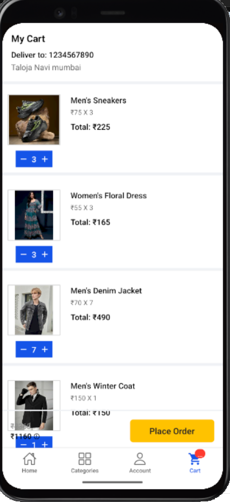
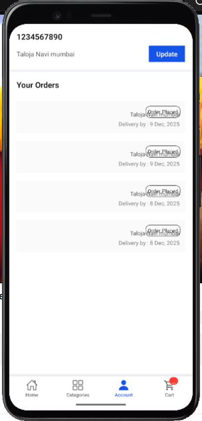
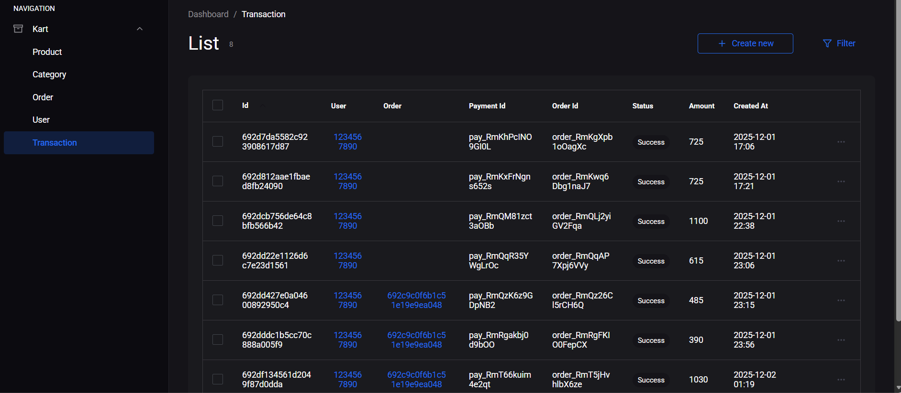

Lunar – Full E-Commerce App (React Native + Node.js + MongoDB + Razorpay + Admin Panel)

Lunar is a fully featured e-commerce mobile application built using React Native CLI with a complete backend using Node.js, Express, MongoDB, and Razorpay for payments.
It includes:

✅ Category-wise product listings
✅ Add to Cart & Checkout
✅ Razorpay payment integration
✅ Order tracking
✅ Admin panel to add/manage products
✅ Firebase asset storage / Cloudinary (optional)

🛒 App Highlights

Beautiful Home Screen with banners

Category-wise product browsing

Add/remove items from cart

Order summary, billing & delivery details

Razorpay secure payment gateway

Admin Panel with:

Add Product

View Product List

Update/Delete Product

View Orders

Fully connected to MongoDB Atlas

Smooth UI with Redux state management

🧩 Tech Stack
Frontend – React Native

React Native CLI

Redux Toolkit

Axios

React Navigation

MMKV Storage

Lottie Animations

Backend – Node.js

Express.js

MongoDB + Mongoose

JWT Authentication

Razorpay Payment Gateway

multer (if using image upload)

Cloudinary (optional for media)

🗂️ Project Structure
/Lunar
 ├── kart/                     # React Native App
 │   ├── src/
 │   │   ├── assets/
 │   │   ├── components/
 │   │   ├── screens/
 │   │   ├── navigation/
 │   │   ├── store/
 │   │   ├── utils/
 │   │   └── api/
 │   └── android/ ios/ etc.
 │
 └── server/                   # Node.js Backend
     ├── models/
     ├── controllers/
     ├── routes/
     ├── config/
     ├── uploads/
     └── .env

📱 Screenshots
🖼️
<table> <tr> <td></td> <td></td> <td></td> <td></td> </tr> <tr> <td></td> <td></td> <td></td> </tr> <tr> <td></td> <td></td> <td></td> <td></td> </tr> </table>

Developed By Premm Chand